# Solution: Interactive CI/CD Deployment Pipeline with Public Trigger

This project demonstrates an unauthenticated, rate-limited public trigger for an AWS CodePipeline, enabling secure, auditable deployments via API Gateway and Lambda. It simulates a real-world scenario where public triggers are needed under strict quota enforcement and monitoring.

---

## 📌 Problem Statement

Enable unauthenticated external users to trigger an internal CI/CD pipeline securely, without risk of abuse. Traditional AWS CI/CD workflows are secured by IAM and kept private. This project explores how to safely expose a limited public entry point without compromising reliability, cost, or traceability.

---

## ⚙️ Architecture Overview

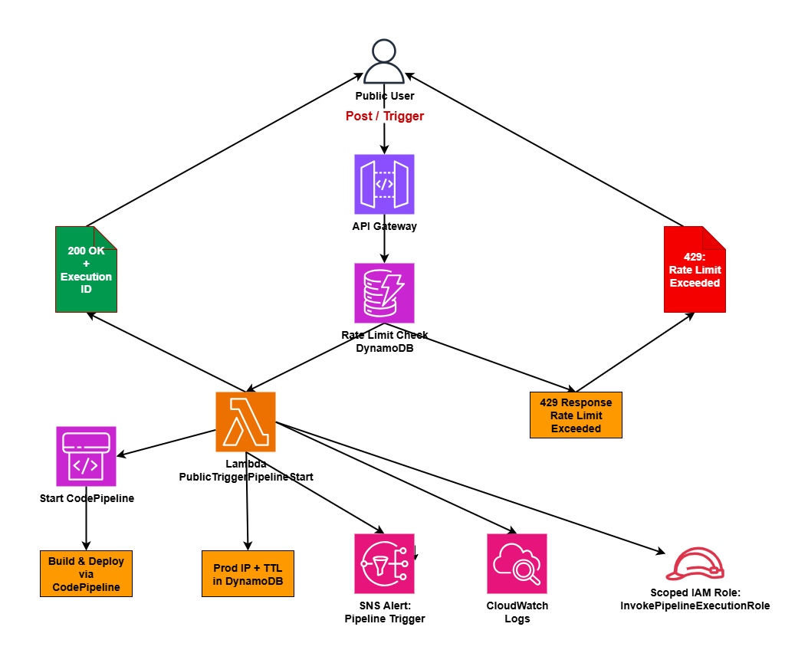

---

## 🚀 Components

| Layer              | AWS Service           | Role                                             |
|-------------------|-----------------------|--------------------------------------------------|
| API Interface      | Amazon API Gateway    | Exposes public `/trigger` endpoint               |
| Rate Limiter       | AWS Lambda + DynamoDB | Enforces 3 requests per IP per 7-day period      |
| Execution Handler  | AWS Lambda            | Triggers the CodePipeline execution              |
| Observability      | CloudWatch + SNS      | Logs traffic and sends alert on each trigger     |
| Audit & Quotas     | DynamoDB TTL          | Enforces data expiry to manage weekly quotas     |

---

## 🛠️ Implementation Steps (Visual Evidence Included)

1. **API Gateway - /trigger Resource**  
   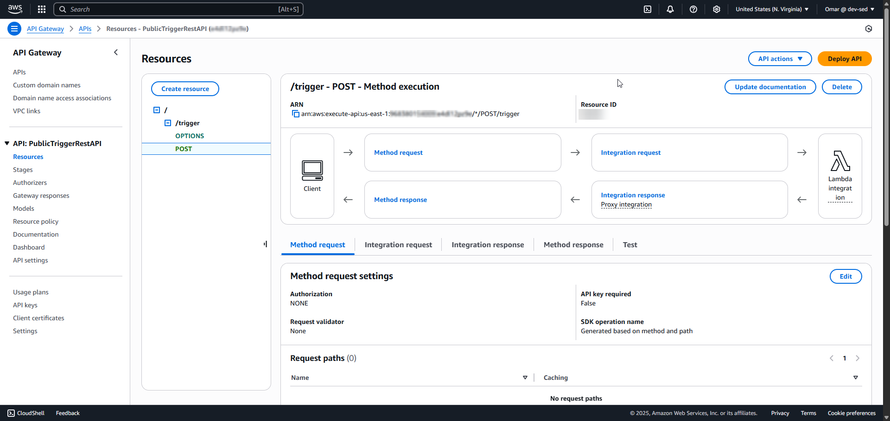  
   *01 - The POST method configured under the /trigger resource.*

2. **Stage Deployment Confirmation**  
   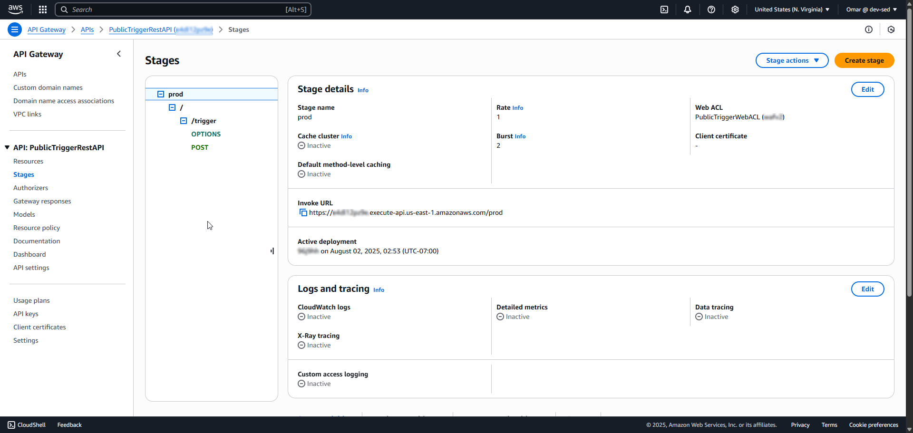  
   *02 - API Gateway production stage deployed with invoke URL.*

3. **Lambda Handler – `PublicTriggerPipelineStart`**  
   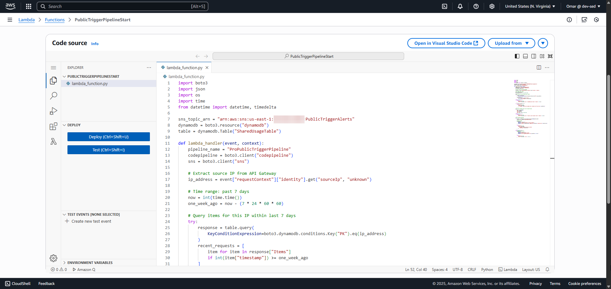  
   *03 - Python code enforces per-IP limits and triggers CodePipeline.*

4. **Lambda Trust Policy**  
   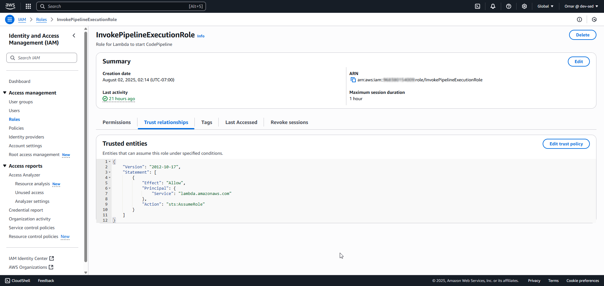

5. **Inline Policies Applied**  
   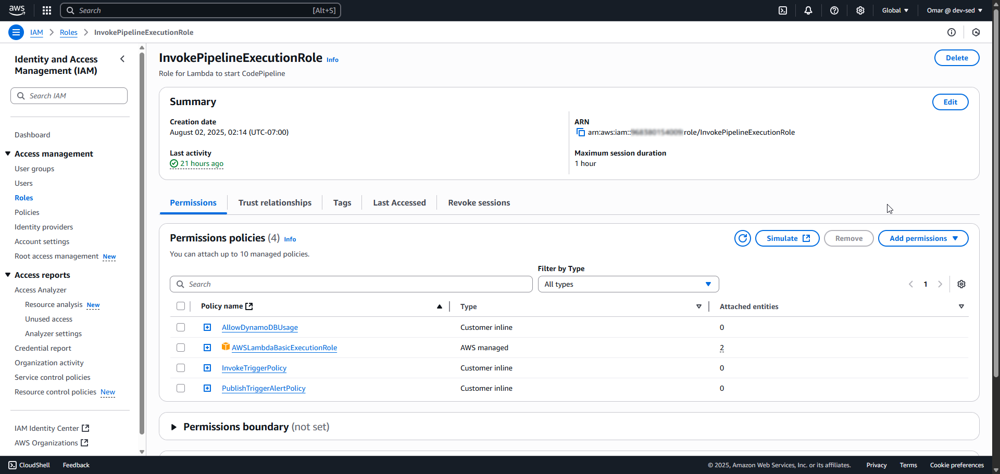

6. **InvokeTriggerPolicy**  
   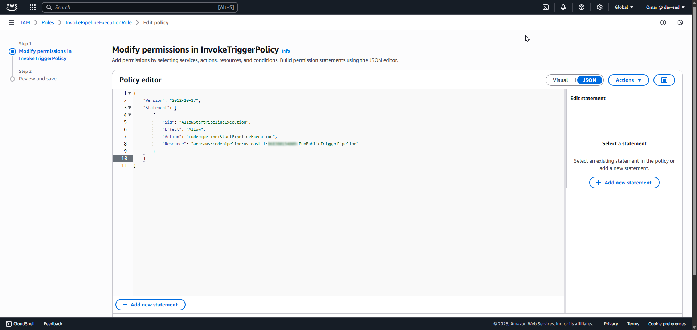

7. **AllowDynamoDBUsagePolicy**  
   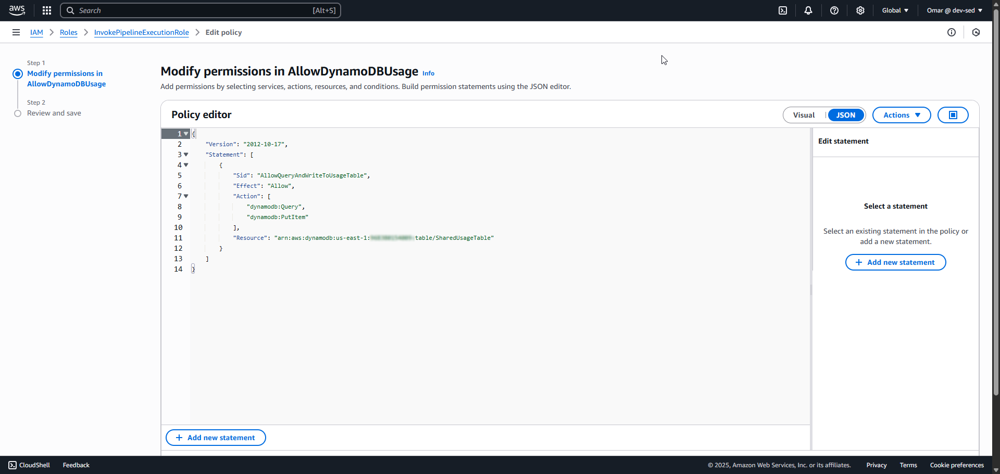

8. **PublishTriggerAlertPolicy**  
   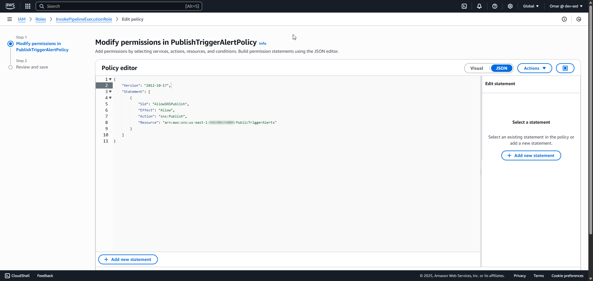

9. **CloudWatch Log – Successful Execution**  
   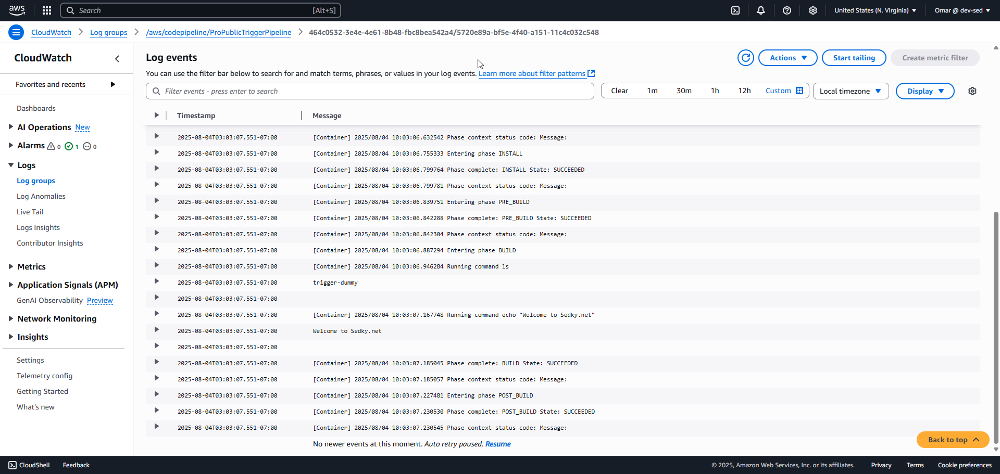

10. **CloudWatch Log – Rate Limited**  
   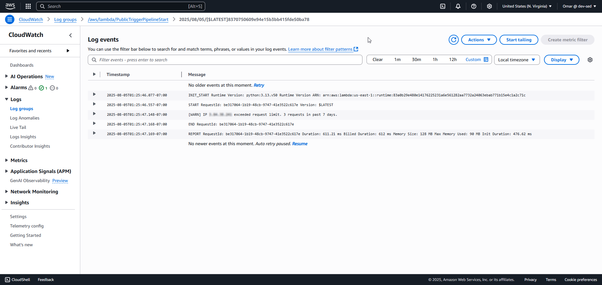

11. **DynamoDB Table Schema**  
   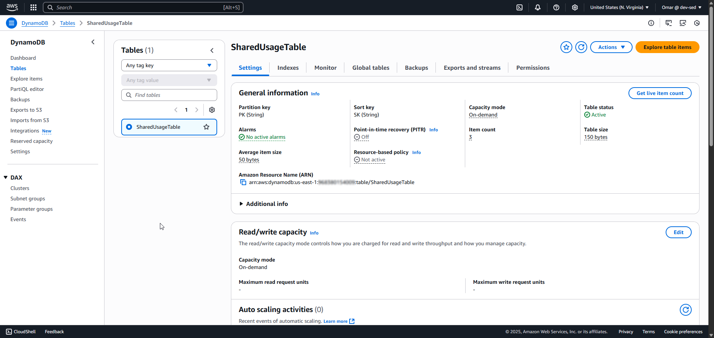

12. **TTL Attribute Enabled**  
   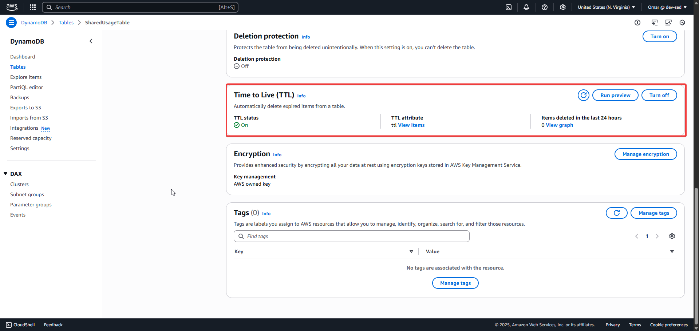

13. **Sample Table Records with TTL**  
   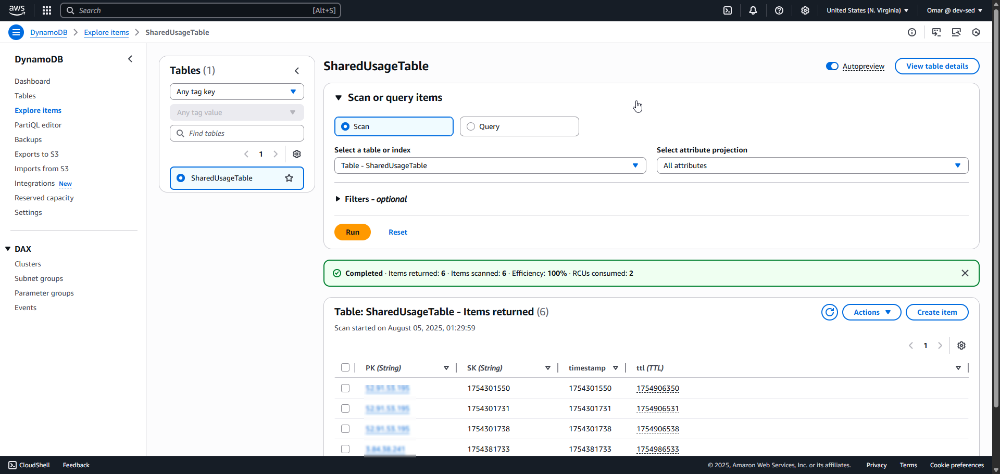

14. **SNS Topic Configuration**  
   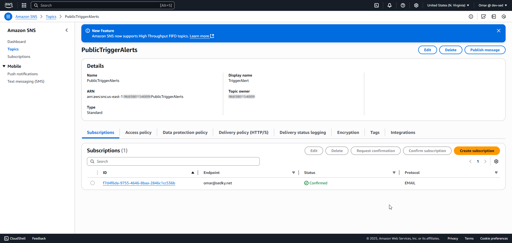

15. **Trigger Email Received**  
   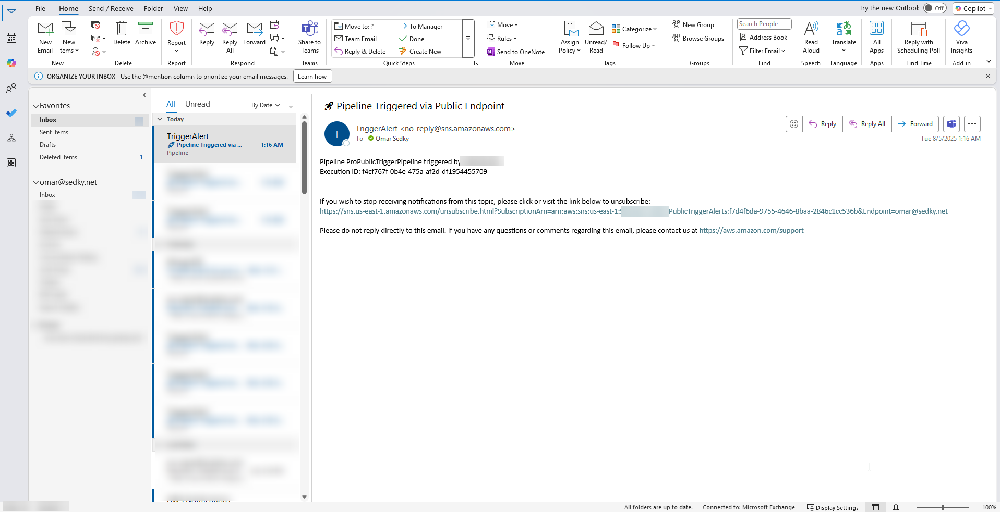

16. **Trigger Execution - cURL Success**  
   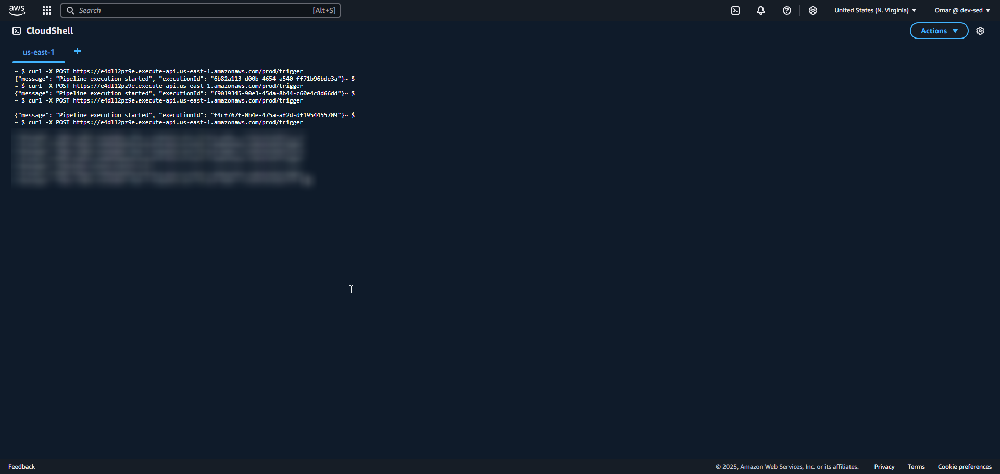

17. **Trigger Denied - Rate Limit Hit**  
   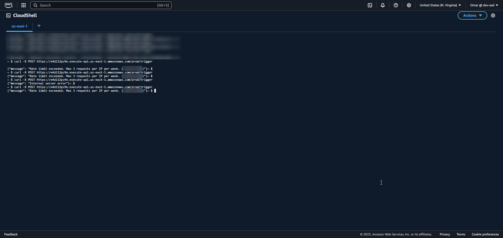

---

## 🔐 Security Controls

- Lambda IAM role scoped to **3 purpose-specific inline policies**
- Per-IP **DynamoDB-based quota enforcement**
- **DynamoDB TTL** enforces 7-day expiry
- **SNS alert** on each trigger for auditability
- Full **CloudWatch logging** for trace and forensic review

---

## ✅ Well-Architected Framework Alignment

| Pillar               | Alignment                                                                 |
|----------------------|---------------------------------------------------------------------------|
| **Security**         | IAM least-privilege, request validation, alerting via SNS                 |
| **Reliability**      | Isolation of abusive actors, no shared state or race conditions           |
| **Operational Excellence** | Fully observable pipeline entry point with failure monitoring      |
| **Cost Optimization**| Serverless architecture, no idle resources, all Free Tier eligible        |
| **Performance Efficiency**| Sub-second Lambda execution, DynamoDB on-demand scaling             |

---

## 🧠 Architect Notes

### Error Handling Beyond Rate Limit

CodePipeline failures are caught and routed through SNS.  
To improve fault resilience, a Dead Letter Queue (DLQ) can be attached to the Lambda. In high-reliability environments, retry policies using EventBridge should also be considered.

---

### Rate Limiting Strategy Comparison

| Method                  | Pros                                         | Cons                                      |
|-------------------------|----------------------------------------------|-------------------------------------------|
| **DynamoDB TTL Logic**  | Tracks fine-grained quotas per IP, persistent | Requires custom logic and maintenance     |
| **API Gateway Throttling** | Built-in, easy setup                      | Cannot enforce per-IP quotas over time    |
| **AWS WAF**             | Global IP block patterns, flexible rules     | Lacks native quota tracking               |

This project uses DynamoDB to enforce “3 requests per IP per 7 days” — a business rule not directly supported by API Gateway or WAF.

---

### DynamoDB Scalability

DynamoDB is set to **on-demand** mode to auto-scale based on real usage. For high-volume traffic:
- Consider provisioned capacity + autoscaling
- Use SK prefixes to partition hot keys
- DynamoDB Accelerator (DAX) may reduce read latency

---

### Cost Notes

| Service         | Optimization |
|----------------|--------------|
| **Lambda**      | Free tier covers up to 1M invocations monthly |
| **API Gateway** | ~$3.50 per million calls, caching optional    |
| **DynamoDB**    | On-demand for low traffic, switchable to provisioned |
| **SNS**         | Email notifications negligible cost            |

This project is cost-effective for public-facing demos or controlled usage in dev environments.

---

## 🧩 Future Enhancements

- Infrastructure-as-Code (CDK or CloudFormation) for repeatable deployment
- DLQ integration with Lambda for retry resilience
- API Gateway usage plans or AWS WAF for perimeter throttling and abuse detection

---

## ✅ Result

The final system securely exposes a public-facing pipeline trigger. It combines Lambda-based execution, DynamoDB quota enforcement, and real-time alerting — all built using fully native AWS services and scoped under Free Tier.

---

**🔗 GitHub:** [github.com/oSedky](https://github.com/oSedky)  
**🌐 Portfolio:** [sedky.net](https://sedky.net)  
**📬 LinkedIn:** [www.linkedin.com/in/omarsedky](https://www.linkedin.com/in/omarsedky)